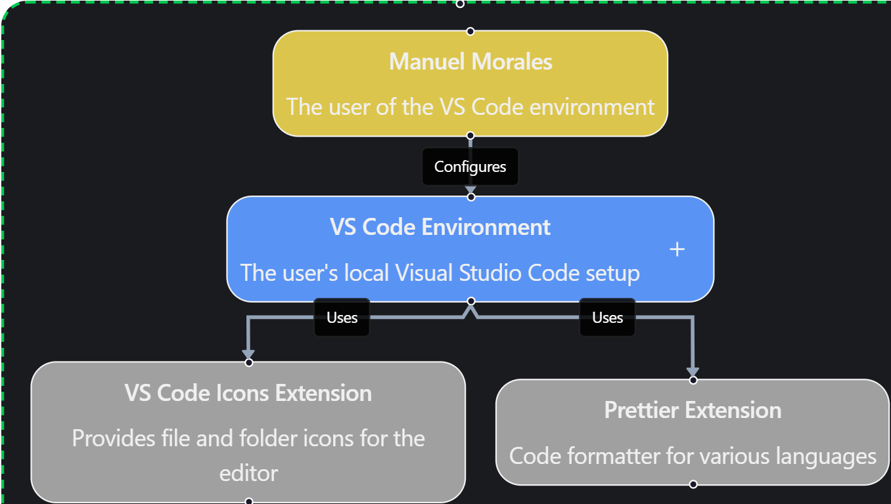

# VS Code Configuration

This repository contains my Visual Studio Code settings and configuration preferences.

## Settings Overview

My `settings.json` file contains the following key configurations:

### Editor Settings
- **Tab Size**: 1 space (minimal indentation)
- **Word Wrap**: Enabled for better readability
- **Minimap**: Disabled for cleaner interface
- **Cursor Blinking**: Set to "expand" for smooth cursor animation
- **Auto Save**: Disabled (manual save preference)
- **Format on Paste**: Enabled for automatic formatting
- **Format on Save**: Enabled for consistent code style

### Code Formatting (Prettier)
- **Default Formatter**: Prettier (esbenp.prettier-vscode)
- **JSX Single Quote**: Enabled (`'` instead of `"`)
- **Semicolons**: Disabled (no trailing semicolons)
- **Single Quotes**: Enabled for all strings

### JavaScript/TypeScript
- **Auto Import Updates**: Always update imports when moving files
- **Emmet Support**: JavaScript files support Emmet with React syntax

### Dart/Flutter
- **Format on Save**: Disabled (handled by Flutter tools)
- **Format on Type**: Enabled for real-time formatting
- **Selection Highlight**: Disabled for cleaner editing
- **Snippet Suggestions**: Quick suggestions not prevented by snippets
- **Suggest Selection**: First suggestion automatically selected
- **Tab Completion**: Only snippets (no word-based completion)
- **Word Based Suggestions**: Disabled to reduce noise

### Go
- **Default Formatter**: `golang.go`
- **Format on Save**: Enabled for Go files
- **Format Tool**: `goimports` for organizing imports automatically

### Visual Theme
- **Icon Theme**: vscode-icons for better file type recognition

## Extensions Used

Based on the settings configuration, I use the following key extensions:

### Essential Extensions
1. **Prettier - Code formatter** (`esbenp.prettier-vscode`)
   - Primary code formatter for consistent styling
   - Configured for single quotes, no semicolons, JSX single quotes

2. **vscode-icons** (`vscode-icons`)
   - Provides comprehensive file and folder icons
   - Improves visual file type recognition

### Recommended Extensions (for full functionality)
To complement these settings, I recommend installing:

#### Development Tools
- **ESLint** - JavaScript/TypeScript linting
- **GitLens** - Enhanced Git capabilities
- **Live Server** - Local development server
- **Thunder Client** - API testing

#### Language Support
- **JavaScript/TypeScript** - Built-in VS Code support
- **HTML/CSS** - Built-in VS Code support
- **JSON** - Built-in VS Code support
- **Flutter/Dart** - For mobile app development
- **Go** - `golang.go` extension for formatting, language features, and Go tooling

#### Productivity
- **Auto Rename Tag** - Paired tag renaming
- **Bracket Pair Colorizer** - Visual bracket matching
- **Indent Rainbow** - Visual indentation guides

## Snippets

This repository includes custom snippets to speed up development.

### Go Snippets
The `languages/go.json` file contains snippets for Go. To use them:
1. Open VS Code.
2. Go to **File > Preferences > Configure User Snippets** (or **Code > Settings > User Snippets** on macOS).
3. Select **Go** from the list.
4. Copy the content of `languages/go.json` into the opened `go.json` file in VS Code.

#### Available Go Snippets:
- `maingo`: Generates a basic Go program template with a `main` function.

### Future Additions
I plan to expand this collection with more snippets for:
- **Go**: Additional templates for common patterns and libraries.
- **Other Languages**: JavaScript, TypeScript, Python, etc.
- **Frameworks**: React, Flutter, Gin, etc.

## Installation

1. Clone this repository
2. Copy `settings.json` to your VS Code settings directory:
   - Windows: `%APPDATA%\Code\User\`
   - macOS: `~/Library/Application Support/Code/User/`
   - Linux: `~/.config/Code/User/`

3. Install the recommended extensions using the VS Code Extensions panel

## Configuration Philosophy

My configuration emphasizes:
- **Clean, minimal code** with single quotes and no semicolons
- **Consistent formatting** with automatic formatting on save
- **Reduced visual clutter** with minimap disabled
- **Efficient workflow** with auto-import updates and format-on-paste

This setup provides a streamlined development experience focused on code readability and consistency.
